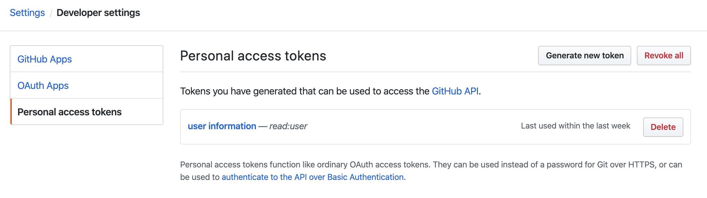

# Individual Project 1
# Estimating Online Site Statistics
#### Due Date
* Thursday Feb 25, 2020 (23:59)

#### Total Points
* 100 (One Hundred)

## Goal
In this project, you will be asked to choose one online site/service with APIs to download data and analyze the collected data. One possible idea is to sample GitHub account IDs and estimate the total number of valid users in Github. In GitHub, user's ID is increasing from 1, but the ID will not be avaiable in GitHub API if the user deletes his/her account. In particular, 5% of the users' ID from 1 to 1000 were missing. Since the limits of GitHub API, you cannot download all the IDs and count the number of missing IDs, you need to sample some IDs and estimate the number of valid users with an unbiased estimator. This project will be completed in Python 3. 

## Deliverables & Grading
* PDF Report (70%) [template](https://www.acm.org/binaries/content/assets/publications/taps/acm_submission_template.docx)
	* proposal
	* methodology
	* empirical results and evaluation
	* conslusion
	
* Python Code (30%)
	* Code is required to avoid plagiarism.

* Grading
  1. Code(30):
     1. Code for data crawling (20)
     2. Code for estimation (10)

  2. Report(70):
     1. Introduction & Proposal (10)
     2. Methodology (20):
        a. Method (10)
        b. Proof of unbiased estimator (5)
        c. Correct proof (5)
     3. Evaluation & Results (30):
     	a. Results from a validation set (15)
	b. Results from the entire id space (15)
     4. Conclusion (10)


## Project Guidelines

#### GitHub API
* [GitHub API documentation](https://developer.github.com/v3/)
* [OAuth token](https://developer.github.com/v3/#oauth2-token-sent-in-a-header)
* [GitHub API users](https://developer.github.com/v3/users/)
* [GitHub API search](https://developer.github.com/v3/search/#search-users)

For API requests using Basic Authentication or OAuth, you can make up to 5000 requests per hour. You can create your personal access tokens under developer settings.
<p align="center">

</p>

#### Sample code

```python
import requests

headers ={
      'Authorization': 'token <TOKEN>', # replace <TOKEN> with your token
    }
# collect data by users API
id_ = 0
response = requests.get('https://api.github.com/users?since='+str(id_),headers=headers)
data = response.json()

# collect data by search API
response = requests.get('https://api.github.com/search/users?q=created:<2020-01-14&created:>2020-01-13',headers=headers)
data = response.json()

# It will return 30 results for each request. You could consider using "for" loop to crawl more data.
# The sample code is the naivest way to collect GitHub users' ID. You can consider other ways to collect data.
# The following is an example of data[0]
    {'login': 'mojombo',
     'id': 1,
     'node_id': 'MDQ6VXNlcjE=',
     'avatar_url': 'https://avatars0.githubusercontent.com/u/1?v=4',
     'gravatar_id': '',
     'url': 'https://api.github.com/users/mojombo',
     'html_url': 'https://github.com/mojombo',
     'followers_url': 'https://api.github.com/users/mojombo/followers',
     'following_url': 'https://api.github.com/users/mojombo/following{/other_user}',
     'gists_url': 'https://api.github.com/users/mojombo/gists{/gist_id}',
     'starred_url': 'https://api.github.com/users/mojombo/starred{/owner}{/repo}',
     'subscriptions_url': 'https://api.github.com/users/mojombo/subscriptions',
     'organizations_url': 'https://api.github.com/users/mojombo/orgs',
     'repos_url': 'https://api.github.com/users/mojombo/repos',
     'events_url': 'https://api.github.com/users/mojombo/events{/privacy}',
     'received_events_url': 'https://api.github.com/users/mojombo/received_events',
     'type': 'User',
     'site_admin': False}
     
#sample NUM ids since UID    
def sample(uid,num):
    ...
    return sample_data
    
#use downloaded data to build estimator  
def estimate(sample_data):
    ...
    return estimation
```
